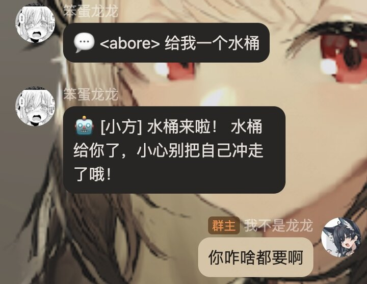
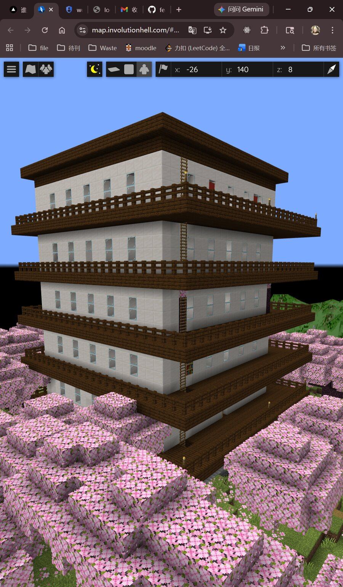

# mc-chat-bot

> **把 QQ 群和游戏打通**：群里发一句话，游戏里立刻执行；游戏里死了挂了升级了，QQ 群里实时推送。AI 当中间人，自然语言搞定一切。

[](https://www.python.org/)
[](https://deepseek.com/)
[](./LICENSE)



*左边 QQ 群发"给我钻石"，右边游戏里 AI 真执行了 `/give`，回信发回 QQ。*

---

## 这玩意儿到底是干嘛的

**核心是一座桥**：

```
        游戏内聊天框                    QQ 群
            ↑↓        ←—— AI 翻译 ——→        ↑↓
        玩家 / 服务端                  群友 / 离线的人
```

具体场景：

| 在哪儿说的 | bot 做了什么 |
|---|---|
| 群友在 QQ 群里说"小方 给老王 64 个钻石" | 游戏里执行 `/give longlong diamond 64`，回执发回 QQ |
| MC 玩家死了 | QQ 群秒到死亡吐槽："你又被苦力怕亲了" |
| 群友 @离线的 MC 玩家 | 玩家 QQ 收到 ping，知道有人找 |
| 玩家在游戏里说"帮我盖一栋 6 层房子" | AI 调几十次 `setblock` 真盖出来，QQ 群同步显示进度 |
| 周日晚 22:00 | AI 自动生成"本周服务器编年史"，QQ 群推送古风叙事 |
| 三角洲玩家在 QQ 群问"上把咋样" | 拉腾讯 AMS 接口，给完整战报+战术建议 |
| 每天早 06:00 | 三角洲群自动收到当日 5 张图密码 |

**双向桥接是这个项目的核心**——市面上要么是"游戏内 AI"、要么是"QQ bot"，把这俩串起来形成连续上下文的不多见。

---

## 已接两个游戏

### 🎮 Minecraft 服务器助手"小方" — **完整双向**



*一段 prompt，AI 盖出来的 6 层豪宅。熔炉、书架立柱、内外双楼梯、照明，一次到位。*

| 玩家说的 | AI 回复 | 执行的指令 |
|---------|---------|-----------|
| "给我 64 个钻石" | 好的，给你 64 钻石！ | `/give <player> diamond 64` |
| "天黑了帮我改白天" | 阳光普照！ | `/time set day` |
| "传送我到 0 64 0" | 嗖！ | `/tp <player> 0 64 0` |
| "召唤一匹马" | 马已就位，请上马！ | `/summon horse ~ ~ ~` |
| "帮我盖一栋 6 层房子，要..." | （动手盖） | 几十次 `/setblock` |

**附赠（不消耗 API 额度）**：
- 💀 死亡吐槽 85+ 条文案，16 种死因各有专属
- 🔔 加入 / 挂机 / 低血量 / 升级 / 进入地狱或末地 都会被小方吐槽
- 📜 每周史诗战报：周日 22:00 古风叙事
- ☠️ 每周死亡集锦：周一 09:00 游戏主播风格复盘

完整模块说明：[`gamebot/games/mc/README.md`](./gamebot/games/mc/README.md)

### 🎯 三角洲行动战术教练 — **单向 QQ 助手**

> 腾讯不开放游戏内 API，所以只能在 QQ 群里给数据查询和教练式建议，没法在游戏内回话。但 AI 的洞察力依然有用。

| 群友说的 | bot 行为 |
|---|---|
| "今天密码" | 5 张图当日密码 |
| "我最近表现咋样" | 拉战绩 → 撤离率/收益/常去图汇总 |
| "推荐打哪张图" | 基于历史数据的战术建议 |
| "上把我们打的咋样" | 单局战报，含队友的英雄+击杀+撤离结果 |
| "我玩牧羊人" | 自动注册：你=牧羊人，下次战报显示昵称 |
| "@王十十寸 现在玩的老黑" | 自动重绑别名（解析 @ + nickname 复用） |

**独有亮点**：
- 🧠 **教练人设**：system prompt 在 [`prompt.md`](./gamebot/games/df/prompt.md)，不动代码就能改 AI 性格
- 🪄 **Agent memory**（仿 [Hermes](https://github.com/NousResearch/hermes-agent) / [OpenClaw](https://github.com/openclaw/openclaw)）：SPO 三元组事实 + 时序事件流 + 按 query 智能 surface。"王老板/王博/王十十十十十寸" 三别名顺藤摸瓜认作一人，bot 不重学（见 [`gamebot/core/memory/`](./gamebot/core/memory/README.md)）
- 🔍 **排除法识别队友**：3 人开黑 + 已注册 alias 反推未识别队友是谁
- 🌐 **未知干员自动 lookup**：遇到没收录的 5 位数 ID 自动查 luoy-oss 社区表
- 🚪 **严格群隔离**：DF 功能限定在三角洲群，不污染 MC 主群
- ⏰ **每天 06:00 自动播报地图密码**

详细：[`gamebot/games/df/README.md`](./gamebot/games/df/README.md) · 独立 CLI：[`scripts/df_stats/README.md`](./scripts/df_stats/README.md)

---

## 加新游戏 = 复制 1 个文件夹

`gamebot/` 三层架构：

```
gamebot/
├── core/                    平台无关
│   ├── ai_provider.py       LLM 抽象（DeepSeek/OpenAI/Anthropic/Ollama）
│   └── qq_bridge.py         OneBot 11，支持多群路由
└── games/
    ├── mc/                  Minecraft 模块（RCON + 日志监听 + 周报）
    └── df/                  三角洲模块（腾讯 AMS + 别名 + 教练）
```

新游戏只要：①复制 `games/df/`，②改 `prompt.md` 改 AI 性格，③在 `abilities.py` 写你的工具。详见 [CLAUDE.md](./CLAUDE.md) 的"加新游戏 5 步"。

---

## 关键约束（也是 trick）

AI 在回复里用 `[CMD:...]` 标签发指令：

```
AI: 好，给你来 64 个钻石 [CMD:give longlong diamond 64]
bot 正则提取 → 走 RCON 执行 → 结果回灌给 AI → AI 决定下一步
```

比强制 JSON 输出**稳定得多**。这套 tool-use 模式被两个游戏共用：MC 走 RCON，DF 走 HTTP 拉接口。

详细技术博客：[**用 AI 助手运营 MC 服务器的实验记录**](https://involutionhell.com/docs/CommunityShare/Geek/mc-ai-bot-experiment)

---

## 3 步跑起来

```bash
# 1. 拉代码
git clone https://github.com/longsizhuo/mc-chat-bot.git && cd mc-chat-bot

# 2. 装依赖（Python 3.10+）
pip install -r requirements.txt

# 3. 配置并启动
cp config.example.yml config.yml
# 编辑 config.yml 填 server_dir / ai.api_key / rcon.password
python run.py
```

**前置要求**：
- MC 模块：Minecraft Java 服务器开了 RCON（`enable-rcon=true`）+ [mcrcon](https://github.com/Tiiffi/mcrcon)
- QQ 桥接（可选）：NapCat / Lagrange / go-cqhttp 之一，OneBot 11 协议，跑在 localhost
- DF 模块（可选）：抓 4 份腾讯 cookie（见 [`scripts/df_stats/README.md`](./scripts/df_stats/README.md)）

<details>
<summary>config.yml 关键字段</summary>

```yaml
server_dir: "/你的/minecraft/服务器/路径"

ai:
  provider: "deepseek"      # deepseek / openai / anthropic / ollama / custom
  api_key: "sk-你的密钥"

rcon:
  password: "你的 rcon 密码"

bot:
  name: "小方"
  language: "zh"

qq:                          # 可选：OneBot11 QQ 桥
  enabled: false
  api_url: "http://localhost:6100"
  group_id: 1101232433       # MC 主群

df_stats:                    # 可选：三角洲群 bot（严格隔离）
  enabled: false
  group_id: 257381453        # 三角洲群号
  secret_curl: "scripts/df_stats/credentials/raw_curl_secret.sh"
  broadcast_hour: 6
```

完整：[`config.example.yml`](./config.example.yml)

</details>

---

## 想直接看效果？

服务器：**mc.involutionhell.com**（26.1.2 + Fabric，离线模式可进）。进去跟小方说一句"你好"，或者让它帮你盖个房子。

---

## 支持的 AI 模型

| Provider | Config `provider` | 备注 |
|----------|-------------------|------|
| DeepSeek | `deepseek` | **推荐**，便宜，中文好 |
| OpenAI | `openai` | 默认 GPT-4o-mini |
| Anthropic | `anthropic` | Claude |
| Ollama | `ollama` | 本地免费，无 API Key |
| 自定义 | `custom` | 任何 OpenAI 兼容 API |

---

## 更多

- [**CLAUDE.md**](./CLAUDE.md) · 给 AI Agent 看的项目维护守则（改代码必须同步改文档、Prompt 与代码分离等）
- [**CHANGELOG**](./CHANGELOG.md) · 按 commit 为节点的改动记录
- [**Agent Skill**](./deploy-mcbot/SKILL.md) · 兼容 [Agent Skills](https://agentskills.io)，Claude Code / Cursor 可自动部署
- [**mc-website**](https://github.com/longsizhuo/mc-website) · 服务器官网源码
- **中英双语** · 所有响应文案都有 `zh` / `en` 两套

欢迎 issue / PR / fork。

---

## 许可证

MIT

---

# English

**mc-chat-bot** — a bridge between **QQ groups and game chat**. Say something in QQ → bot executes in game. Something happens in game → QQ group gets a push. AI is the middleman, natural language handles everything.

The unique value is the **bidirectional bridge** (not "yet another game AI" or "yet another QQ bot"). Already wired:

- 🎮 **Minecraft "小方"** — full bidirectional: RCON exec, builds houses from prompts, death roasts, weekly chronicles
- 🎯 **Delta Force coach** — one-way (Tencent doesn't expose game API): pulls battle records via AMS, coach-style advice, daily map codes, smart alias inference

A 3-layer framework (`core/` + `games/`) makes adding a third game = copy `games/df/` and edit `prompt.md`.

### Quick start

```bash
git clone https://github.com/longsizhuo/mc-chat-bot.git && cd mc-chat-bot
pip install -r requirements.txt
cp config.example.yml config.yml   # edit server_dir, ai.api_key, rcon.password
python run.py
```

Requires Minecraft Java server with RCON enabled and [mcrcon](https://github.com/Tiiffi/mcrcon).

### Key trick

AI emits `[CMD:...]` tags in its replies, bot regex-extracts and executes via RCON (MC) or HTTP (DF). Much more stable than forcing JSON output. Same tool-use pattern shared by both games.

Full writeup: [MC AI Bot Experiment](https://involutionhell.com/docs/CommunityShare/Geek/mc-ai-bot-experiment)

Live server: **mc.involutionhell.com** (26.1.2 + Fabric, offline mode OK). MIT license.
